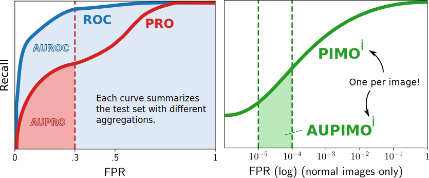

# AUPIMO

AUPIMO stands for **A**rea **U**nder the **P**er-**IM**age **O**verlap curve (pronounced _a-u-pee-mo_).

Official implementation of the paper [**AUPIMO: Redefining Visual Anomaly Detection Benchmarks with High Speed and Low Tolerance**](https://arxiv.org/abs/2401.01984) (accepted to BMVC 2024, coming up in November 2024).

Interpretation of an AUPIMO score 

> “An AUPIMO score is the [cross-threshold] average segmentation recall in an image given that the model (nearly) does not yield FP
regions in normal images”.



## Integration in `anomalib`

AUPIMO is available in [`anomalib`](https://github.com/openvinotoolkit/anomalib)! 

Tutorials in [`anomalib/notebooks/700_metrics`](https://github.com/openvinotoolkit/anomalib/tree/main/notebooks/700_metrics).

Warning: this version includes the following features available (**not** available in `anomalib`):
- `numpy`-only API (only `torch` and `torchmetrics`-based API)
- `numba` accelaration (makes it considerably slower)

## Installation

If you want to use AUPIMO, you can clone the git repository and install it with pip:

```bash
git clone git@github.com:jpcbertoldo/aupimo.git
cd aupimo
pip install .
```

You can add it to your `requirements.txt` file as `aupimo @ git+https://github.com/jpcbertoldo/aupimo`.

> PYPI package COMING UP

## Reproducing and extending paper results

If you want to reproduce or extend the results of the paper, install the requirements in `requirements/aupimo-paper.txt` as well:

```bash
git clone git@github.com:jpcbertoldo/aupimo.git
cd aupimo
pip install -e .  # `-e` is for 'editable' mode
pip install -r requirements/aupimo-paper.txt
```

> **Important:** it is recommended to use a virtual environment to install the dependencies and run the tests.
> We recommend using `conda`, and an enviroment file `dev-env.yml` is provided at the root of the repository.
> Install it with `conda env create -f dev-env.yml` and activate it with `conda activate aupimo-dev`.

### Data setup

In order to recompute the metrics reported in the paper you can use the script `scripts/eval.py`.

You will need to first setup the data, the anomaly score maps and images with their masks from the public datasets.

#### Anomaly score maps (`asmaps`)

Download them by running `data/experiments/download_asmaps.sh` then unzip the downloaded zip file exactly where it is (it will match the folder structure of in `data/experiments/benchmark`).

#### Images and masks

You can download MVTec AD and VisA from their respective original sources:

- MVTec AD: <https://www.mvtec.com/company/research/datasets/mvtec-ad/>
- VisA: <https://amazon-visual-anomaly.s3.us-west-2.amazonaws.com/VisA_20220922.tar>

You should unpack the data in folders respecitvely named `MVTec` and `VisA`, and the paths to these folders will be passed to the `eval.py` script.

## Development

If you want to modify the package and eventually open a Pull Request, install the requirements in `requirements/dev.txt` and install pre-commit hooks:

```bash
git clone git@github.com:jpcbertoldo/aupimo.git
cd aupimo
pip install -e .  # `-e` is for 'editable' mode
pip install -r requirements/dev.txt
pre-commit install
```

Run the tests in `tests/` locally with `pytest` before opening a Pull Request:

```bash
pytest tests/
```

> **Important:** it is recommended to use a virtual environment to install the dependencies and run the tests.
> We recommend using `conda`, and an enviroment file `dev-env.yml` is provided at the root of the repository.
> Install it with `conda env create -f dev-env.yml` and activate it with `conda activate aupimo-dev`.

## Cite Us

```tex
@misc{bertoldo2024aupimo,
      author={Joao P. C. Bertoldo and Dick Ameln and Ashwin Vaidya and Samet Akçay},
      title={{AUPIMO: Redefining Visual Anomaly Detection Benchmarks with High Speed and Low Tolerance}}, 
      year={2024},
      url={https://arxiv.org/abs/2401.01984}, 
}
```

arXiv: <https://arxiv.org/abs/2401.01984> (accepted to BMVC 2024)

AUPIMO was developed during Google Summer of Code 2023 (GSoC 2023) with the anomalib team from Intel's OpenVINO Toolkit.
- GSoC 2023 page: <https://summerofcode.withgoogle.com/archive/2023/projects/SPMopugd>
- Medium post: <https://medium.com/p/c653ac30e802>

Presentation at Mines Paris - PSL University in 2024-10, Paris, France:
- PDF: <https://cloud.minesparis.psl.eu/index.php/s/aVZrWbpye4DQgWA>
- online slides: <https://docs.google.com/presentation/d/e/2PACX-1vRlmzAsufLSwJK0rYUUqRvJ6cpVMzY99GhRE4EHgC8LF0IzG5A_Wod5SeQsxiNYOHp0U6LWUeoerw_X/pub?start=false&loop=false&delayms=3000>

Papers With Code: <https://paperswithcode.com/paper/aupimo-redefining-visual-anomaly-detection>
